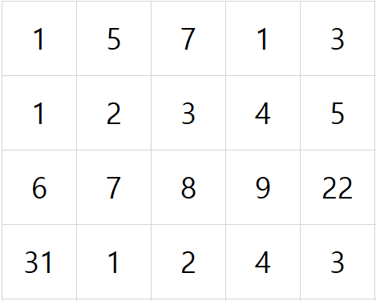
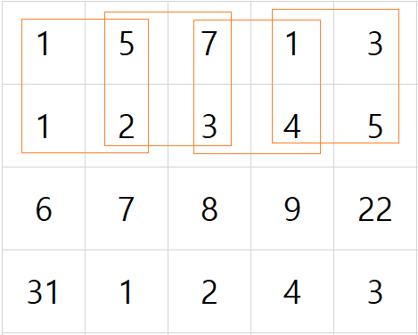

# SWEA. 2001. 파리 퇴치

### 풀이 방법  

1. 파리의 마릿수 정보를 2차원 리스트로 받는다.
2. 파리는 NxN 배열에서 MxM크기의 영역의 파리들을 잡는 것이다.
3. 따라서 N-M만큼 반복하며, MxM크기의 영역의 합을 모두 검사한다.
    - 다음과 같은 5x5의 크기에서
    - 
    - 2x2만큼의 파리를 잡는다고 하자
    - 
    - 위처럼 반복하면서 잡으면 된다. (반복문을 N-M만큼 모든 행, 열을 검사한다.)

