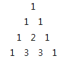
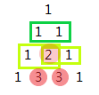

# SWEA. 2005. 파스칼의 삼각형

### 풀이 방법  

1. 먼저 초기값으로 2번째 삼각형까지의 리스트를 만들어 둔다.
2. 파스칼의 삼각형은 다음과 같은 모양이다.
   -  
3. 해당 삼각형의 규칙을 찾아보자
    - 
    - 초록색, 연두색으로 칠한 부분을 더한 값이 아래에 채워진다.
    - 양쪽 맨 끝의 값은 무조건 1이다.
4. 따라서 양쪽에 1의 값을 고정으로 넣어주고, 위 삼각형 행의 길이 -1만큼 반복해서 2개의 숫자를 더한 값을 아래에 넣는다.
